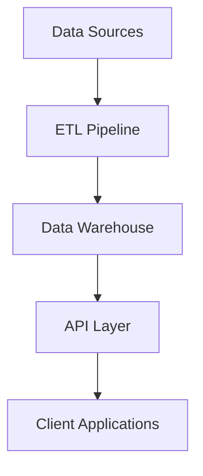

# Documentation Development Instructions

This directory contains authoritative project documentation for the ticker-converter application. Follow these instructions for consistent, comprehensive documentation maintenance.

## Directory Purpose

The `/docs/` directory provides structured documentation including:
- **Architecture documentation** for system design and technical decisions
- **Deployment guides** for local development and production environments
- **User guides** for end-user functionality and CLI operations
- **API documentation** for internal and external interfaces

## Documentation Organization

### Directory Structure
```
docs/
├── README.md                              # Documentation overview and navigation
├── architecture/                         # Technical design documentation
│   ├── overview.md                       # High-level system architecture
│   ├── database_schema_and_operations.md # Database design and operations
│   ├── etl_pipeline_implementation.md    # ETL pipeline architecture
│   ├── airflow_setup.md                  # Airflow configuration and setup
│   └── technology_choices.md             # Technology selection rationale
├── deployment/                           # Deployment and operations guides
│   ├── local_setup.md                    # Local development environment
│   ├── production.md                     # Production deployment guide
│   └── ci_cd.md                          # CI/CD pipeline documentation
└── user_guides/                          # End-user documentation
    ├── cli_usage.md                      # Command-line interface guide
    ├── api_reference.md                  # API usage documentation
    └── troubleshooting.md                # Common issues and solutions
```

## Documentation Standards

### Writing Guidelines

**Structure Requirements**:
- **Clear headings** with logical hierarchy (H1 → H2 → H3)
- **Table of contents** for documents longer than 5 sections
- **Cross-references** to related documentation
- **Code examples** with syntax highlighting
- **Consistent formatting** across all documents

### Markdown Standards
```markdown
# Document Title (H1 - only one per document)

## Major Section (H2)

### Subsection (H3)

#### Detail Section (H4)

**Important concepts** in bold
*Emphasis* in italics
`code snippets` in backticks
```

### Code Documentation
```markdown
## Code Examples

### Python Code
```python
def example_function(param: str) -> dict:
    """Example function with proper documentation."""
    return {"result": param}
```

### SQL Examples
```sql
-- Example query with explanation
SELECT symbol, close_price, volume
FROM stock_data
WHERE date_recorded >= '2023-01-01'
ORDER BY date_recorded DESC;
```

### Command Line Examples
```bash
# Install dependencies
pip install -e .[dev]

# Run tests
pytest tests/
```
```

## Architecture Documentation

### System Design Documents

**`architecture/overview.md`** - High-level system architecture:
- **System components** and their interactions
- **Data flow diagrams** showing ETL pipeline
- **Technology stack** overview and rationale
- **Scalability considerations** and future planning

**`architecture/database_schema_and_operations.md`** - Database design:
- **Entity-relationship diagrams** for data models
- **Table schemas** with field descriptions
- **Indexing strategies** for performance optimization
- **Migration procedures** for schema changes

**`architecture/etl_pipeline_implementation.md`** - ETL pipeline details:
- **Data ingestion processes** from external APIs
- **Transformation logic** and business rules
- **Loading strategies** for different data types
- **Error handling and recovery** procedures

### Technical Decision Documentation
```markdown
## Technology Choice: Apache Airflow

### Decision Context
We needed a workflow orchestration tool for managing complex ETL pipelines.

### Options Considered
1. **Apache Airflow** - Python-based workflow management
2. **Prefect** - Modern Python workflow engine
3. **Luigi** - Spotify's pipeline framework

### Decision
Selected Apache Airflow based on:
- **Mature ecosystem** with extensive community support
- **Rich UI** for monitoring and debugging workflows
- **Flexible scheduling** and dependency management
- **Strong integration** with Python data ecosystem

### Implementation Notes
- Using TaskFlow API for cleaner DAG definitions
- Implementing custom operators for domain-specific tasks
- Leveraging Airflow's built-in retry and alerting mechanisms
```

## Deployment Documentation

### Environment Setup Guides

**`deployment/local_setup.md`** - Local development environment:
- **Prerequisites** and system requirements
- **Installation steps** with detailed commands
- **Configuration** for development databases and APIs
- **Verification procedures** to confirm setup success

**`deployment/production.md`** - Production deployment:
- **Infrastructure requirements** and specifications
- **Security considerations** and hardening procedures
- **Monitoring and alerting** setup instructions
- **Backup and recovery** procedures

### CI/CD Documentation
```markdown
## GitHub Actions Workflow

### Pipeline Stages

1. **Code Quality**
   ```yaml
   - name: Run Black
     run: black --check src/
   - name: Run Pylint
     run: pylint src/
   - name: Run MyPy
     run: mypy src/
   ```

2. **Testing**
   ```yaml
   - name: Run Tests
     run: pytest --cov=src tests/
   - name: Upload Coverage
     uses: codecov/codecov-action@v3
   ```

3. **Security Scanning**
   ```yaml
   - name: Security Scan
     run: safety check -r requirements.txt
   ```
```

## User Documentation

### CLI Usage Guide

**`user_guides/cli_usage.md`** - Command-line interface:
- **Installation instructions** for end users
- **Command reference** with examples and options
- **Common workflows** and use cases
- **Error messages** and troubleshooting

### API Documentation
```markdown
## REST API Endpoints

### Get Stock Data
```http
GET /api/v1/stocks/{symbol}?start_date=2023-01-01&end_date=2023-12-31
```

**Parameters:**
- `symbol` (string, required): Stock ticker symbol (e.g., "AAPL")
- `start_date` (string, optional): Start date in YYYY-MM-DD format
- `end_date` (string, optional): End date in YYYY-MM-DD format

**Response:**
```json
{
  "symbol": "AAPL",
  "data": [
    {
      "date": "2023-01-01",
      "open": 150.00,
      "high": 155.00,
      "low": 149.00,
      "close": 154.00,
      "volume": 1000000
    }
  ],
  "metadata": {
    "total_records": 365,
    "date_range": {
      "start": "2023-01-01",
      "end": "2023-12-31"
    }
  }
}
```
```

## Documentation Maintenance

### Update Procedures

**When code changes**:
1. **Review affected documentation** for accuracy
2. **Update API documentation** if interfaces change
3. **Revise architecture docs** for significant changes
4. **Test code examples** to ensure they work
5. **Update version references** and dependencies

**When new features are added**:
1. **Document new functionality** in relevant user guides
2. **Add architecture documentation** for complex features
3. **Update CLI documentation** for new commands
4. **Include troubleshooting guidance** for common issues

### Quality Assurance

**Documentation Review Checklist**:
- [ ] **Accuracy**: All information current and correct
- [ ] **Completeness**: All necessary information included
- [ ] **Clarity**: Easy to understand for target audience
- [ ] **Consistency**: Follows established style and format
- [ ] **Examples**: Code examples tested and working
- [ ] **Links**: All internal and external links functional

### Automated Documentation

**Generated Documentation**:
```python
# Use Sphinx for API documentation generation
# docs/conf.py
extensions = [
    'sphinx.ext.autodoc',
    'sphinx.ext.viewcode',
    'sphinx.ext.napoleon'
]

# Generate docs from docstrings
sphinx-build -b html docs/ docs/_build/
```

**Documentation Testing**:
```python
# Test code examples in documentation
def test_documentation_examples():
    """Verify code examples in documentation work correctly."""
    # Extract and test code blocks from markdown files
    pass
```

## Cross-Reference Management

### Internal Linking
```markdown
For detailed setup instructions, see [Local Setup Guide](deployment/local_setup.md).

The ETL pipeline architecture is described in [ETL Implementation](architecture/etl_pipeline_implementation.md).
```

### External References
```markdown
## References

- [Apache Airflow Documentation](https://airflow.apache.org/docs/)
- [FastAPI User Guide](https://fastapi.tiangolo.com/)
- [Pytest Documentation](https://docs.pytest.org/)
```

## Documentation Workflow Integration

### With Development Process

**During feature development**:
1. **Update documentation** alongside code changes
2. **Include doc updates** in pull requests
3. **Review documentation** as part of code review
4. **Test examples** before merging changes

**During releases**:
1. **Review all documentation** for accuracy
2. **Update version references** throughout docs
3. **Generate fresh API documentation** from code
4. **Publish updated documentation** to relevant platforms

### With Project Roadmap

**Documentation tasks in project phases**:
- **Phase planning**: Identify documentation requirements
- **Development**: Maintain docs alongside implementation
- **Testing**: Validate documentation accuracy
- **Deployment**: Update deployment guides
- **Maintenance**: Regular documentation reviews

## Accessibility and Usability

### Audience Considerations

**Developer Documentation**:
- **Technical depth** appropriate for software engineers
- **Code examples** with full context
- **Architecture diagrams** for complex systems
- **Performance considerations** and optimization tips

**User Documentation**:
- **Clear instructions** for non-technical users
- **Step-by-step procedures** with screenshots where helpful
- **Common use cases** and examples
- **Troubleshooting guides** for frequent issues

### Documentation Formats

**Markdown Standards**:
- **Consistent heading structure** for navigation
- **Code syntax highlighting** for readability
- **Table formatting** for structured data
- **Image embedding** with alt text for accessibility

**Diagram Integration**:
```markdown
## System Architecture


```

## Version Control for Documentation

### Change Tracking
- **Meaningful commit messages** for documentation changes
- **Branch strategy** aligned with code development
- **Review process** for significant documentation updates
- **Release notes** summarizing documentation changes

### Historical Preservation
- **Archive outdated versions** for reference
- **Maintain change logs** for major documentation revisions
- **Link to previous versions** when structure changes significantly
- **Preserve examples** that may be useful for legacy systems
